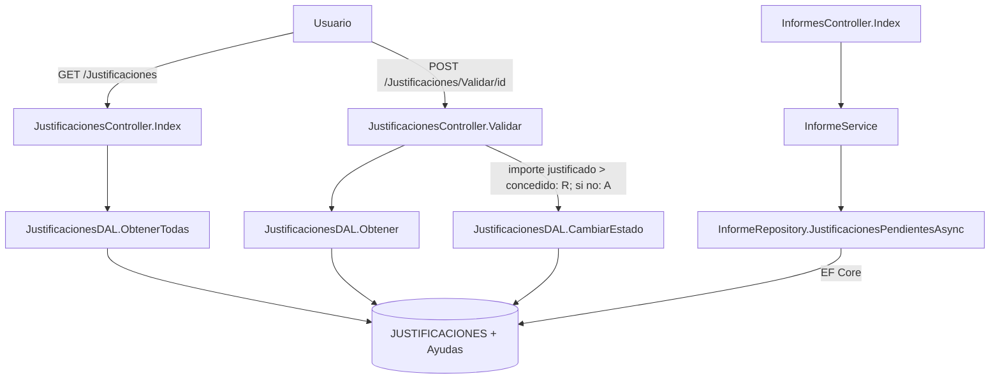

# Módulo de justificaciones

Documentación del módulo heredado `src/Ayudas.Web/Legacy/Justificaciones/`, contrastada con el
código de la rama `s2-inicio`. Sustituye a `docs/antiguo/justificaciones-manual-tecnico.md`.

## Qué hace

Registra la justificación del gasto de cada ayuda concedida y permite validarla. Cada
justificación está en uno de tres estados: `P` (pendiente), `A` (aprobada) o `R` (rechazada).

- Entradas: la ruta `/Justificaciones` (listado con filtro por estado), `/Justificaciones/Detalle/{id}` y el POST `/Justificaciones/Validar/{id}`.
- Lógica: al validar, si el importe justificado supera el concedido la justificación se rechaza (`R`); si no, se aprueba (`A`). La regla está en el controlador, no en la base de datos.
- Datos: tabla `JUSTIFICACIONES`, con nombres de columna heredados, unida a `Ayudas` por `ID_AYUDA`.

## Flujo

## Dónde se toca `Justificacion`

| Capa | Fichero y línea | Uso |
|---|---|---|
| Dominio | `src/Ayudas.Domain/Entidades/Justificacion.cs` | Entidad de EF sobre la tabla heredada |
| Dominio | `src/Ayudas.Domain/Entidades/Ayuda.cs:28` | Colección `Justificaciones` de cada ayuda |
| Persistencia | `src/Ayudas.Infrastructure/Persistencia/Configuraciones/JustificacionConfiguration.cs:14` | Mapeo a `JUSTIFICACIONES` y sus columnas |
| Persistencia | `src/Ayudas.Infrastructure/Persistencia/AyudasDbContext.cs:16` | `DbSet<Justificacion>` |
| Persistencia | `src/Ayudas.Infrastructure/Persistencia/DatosSemilla.cs:177` | Datos de prueba |
| Repositorio | `src/Ayudas.Infrastructure/Repositorios/InformeRepository.cs:33` | Justificaciones pendientes (estado `P`) para el informe |
| Servicio | `src/Ayudas.Application/Servicios/InformeService.cs:20` | Incluye las pendientes en el resumen |
| Vista | `src/Ayudas.Web/Views/Informes/Index.cshtml:46` | Enlaza al detalle del módulo heredado |
| Módulo heredado | `src/Ayudas.Web/Legacy/Justificaciones/JustificacionesController.cs:5` | Listado, detalle y validación (regla en la línea 48) |
| Módulo heredado | `src/Ayudas.Web/Legacy/Justificaciones/JustificacionesDAL.cs:9` | ADO.NET directo; `UPDATE` en la línea 65 |
| Arranque | `src/Ayudas.Web/Program.cs:21` y `:26` | Ruta de las vistas del módulo y cadena de conexión estática del DAL |

## Lo que dice la documentación antigua y ya no es verdad

| Afirmación de `docs/antiguo/justificaciones-manual-tecnico.md` | Lo que hace el código |
|---|---|
| Los datos están en la tabla `JUSTIF_HIST`, con histórico | La tabla es `JUSTIFICACIONES` y no guarda histórico: el `UPDATE` sobrescribe el estado |
| Un trigger `TR_JUSTIF_IMPORTE` impide justificar más de lo concedido | No hay trigger (el esquema lo crea EF). La regla está en `JustificacionesController.Validar` y rechaza, no impide guardar |
| El módulo es independiente; nada más consulta la tabla | El informe de pendientes la lee por EF Core (`InformeRepository`) y enlaza al detalle |

## Sin verificar

- Quién usa la ruta `/Justificaciones/Validar` fuera de la pantalla de detalle: no hay otras llamadas en el repositorio.
- Si otras aplicaciones del organismo escriben en `JUSTIFICACIONES`: no se puede saber desde este código.
